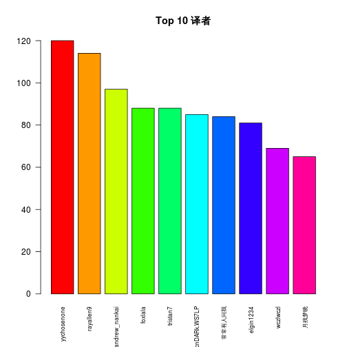

Title:
==
此处略去500字

## overall statistics

这里的数据一共收录了12949篇文章，当时收集的时候主要是根据文章的加色来简单判断的，所以其中难免存在一些多余或者是遗漏（特别是早期的一些文章加色上还没有十分统一)，但我想信这对总体的数据影响还属于可以接受的程度。

### 一些事实

* 这里收录的最早的一篇文章 [资源集束器][first],其实这个并不是翻译帖子，不过当时也被加了蓝色，所以就被收进来了。

[first]: http//bbs.hupu.com/48786.html   

* 12949篇帖子一共有1947个ID,平均每个id发帖6.65篇

* 在所有的id中，发帖前十的十大id是：

<table border="1">
<tr>
<td>id</td><td>作品数</td></tr>
<tr>
<td>yychosenone</td><td>120</td></tr>
<tr>
<td>rayallen9</td><td>114</td></tr>
<tr>
<td>andrew_nankai</td><td>97</td></tr>
<tr>
<td>foxlala</td><td>88</td></tr>
<tr>
<td>tristan7</td><td>88</td></tr>
<tr>
<td>cnDARk.WS7LP</td><td>85</td></tr>
<tr>
<td>常常有人问我</td><td>84</td></tr>
<tr>
<td>elgin1234</td><td>81</td></tr>
<tr>
<td>wczlwczl</td><td>69</td></tr>
<tr>
<td>月残梦晓</td><td>65</td></tr>
</table>
 

* 前100名的译者一共翻译了4387篇帖子，占到了全部作品的33.88%，超过了1/3, 和著名的2/8定律相比，前20%的译者翻译了8752篇，占到全部帖子的66%

*
